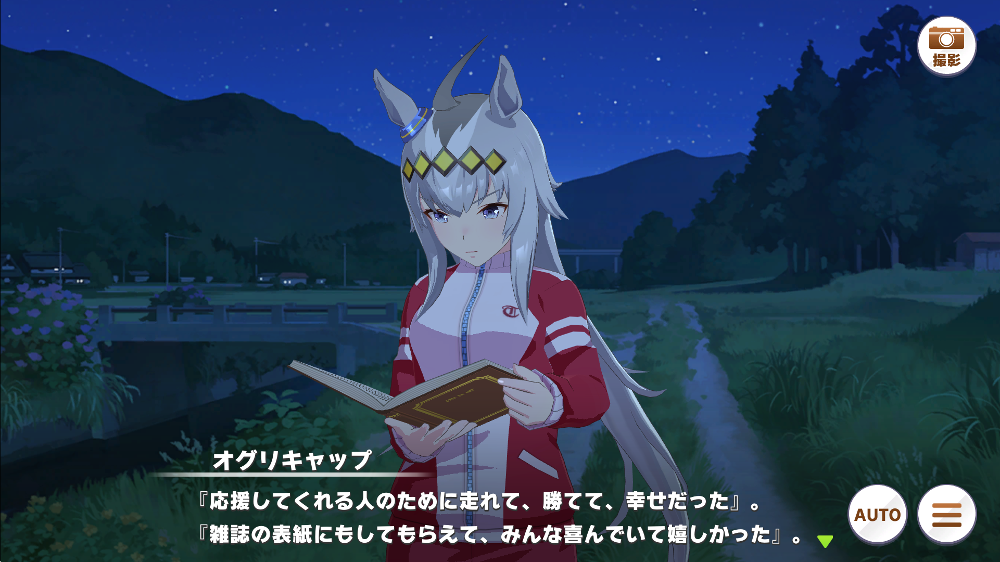
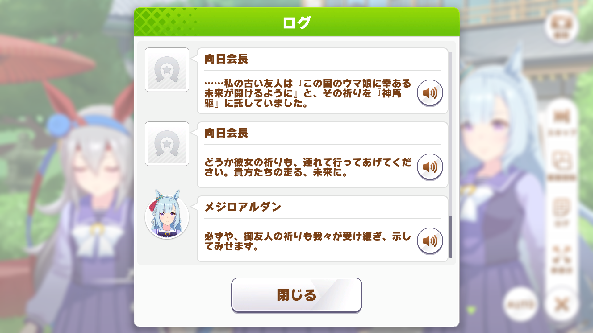
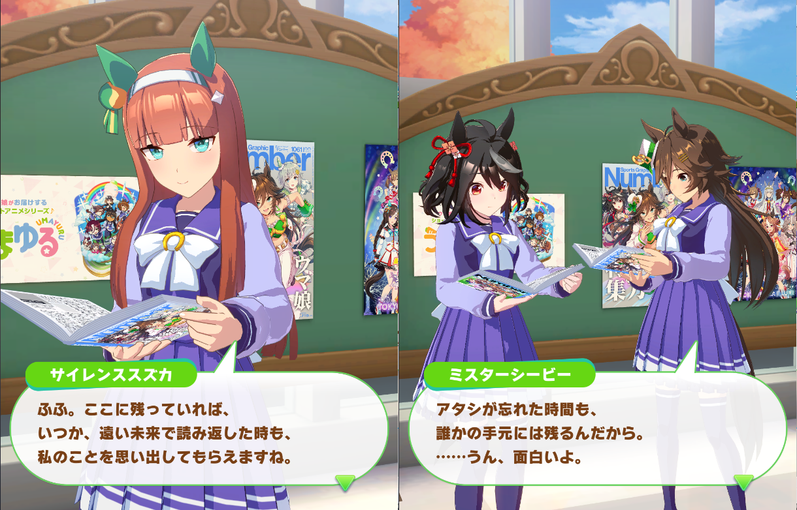
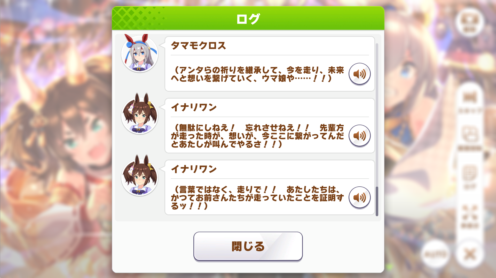

## ウマ娘におけるシナリオの多層性

ウマ娘のシナリオは、１つのことを描いてるように見えて、そこに複数の意図や意味を見出すことができる。

例えばアストンマーチャンの育成シナリオでは「忘れられることは悲しい」という感情が中心にあった。そのまま読んでも楽しめた一方、ＧⅠを獲った名馬でさえ時代が過ぎれば忘れさられるという「競馬あるある」を踏まえて読めば趣深さが増し、泣きゲーのオマージュとして読めばそれはさらに加速する。

書かれていることをそのまま受け取ってもいいし、制作陣が持たせた含み――つまりはコンテクストを読みに行ってもいいというウマ娘シナリオの特長は、今回も遺憾なく発揮された。

イベントストーリー『おもいより　おもいかけ』は神馬駆という神事に挑むオグリキャップたちを描きながら、神事と競馬の共通点を掘り下げるシナリオだったのである。

## シナリオの柱は想いの継承

本シナリオは、蹄板に込められた先達たちの想いの継承が柱となっている。特に言及される先達たちは以下の通りと推測できる。

- タマモクロス：父シービークロス
- イナリワン：父ミルジョージ
- ヤエノムテキ：父が同じライトカラー
- メジロアルダン：父アスワン
- オグリキャップ：ハイセイコーとネイティヴダンサー

ヤエノとアルダンがいてチヨノオーがいないのは座りが悪かったのだが、こういう流れなら納得である（育成シナリオが「父マルゼンの出られなかったダービーに勝つ」という想いの継承をテーマにしているので丸かぶり）。

面白いのはオグリの先達にネイティヴダンサーを含ませていることだろう。

オグリの先達は基本的に“元祖アイドルホース”ハイセイコーなのだが、「アイドル」ではなく「雑誌の表紙」とすることで、TIME誌の表紙を飾った２代父“グレイゴースト”ネイティヴダンサーも視野に入る。

ウマ娘は『シンデレラグレイ』というコミカライズタイトルからも、ネイティヴダンサーへの目配りは意識的である。

<blockquote class="twitter-tweet">
この「灰かぶり」には、オグリキャップにとって父父に当たる“灰色の幽霊”ネイティブダンサーも掛かってくる。企画構成をいとうPが担当してるだけあってさすがの練り込みよう
&mdash; ゆんぼ (@JungerCH) <a href="https://twitter.com/JungerCH/status/1514536808306311169?ref_src=twsrc%5Etfw">April 14, 2022</a></blockquote> 

## セントライトと“神馬”シンザン

以上の流れを踏まえると、神馬駆を統括する向日会長がネームドなのも意味深だ。イベントストーリーのゲストキャラがネームドだった例はほとんどなく、駿大祭を描いた去年のイベストでも舞の指導者は“奉納舞講師”となっていた。

ウマ娘世界における“会長”といえばシンボリルドルフだが、ウマ娘を厳しく指導しつつも行く末を見守るルドルフと同じ精神性を持つ“会長”で向日ともなれば“初代三冠馬”セントライトがモチーフと言っていいだろう。

となれば「この国のウマ娘の幸ある未来を祈る古い友人」はシンザンをおいて他にない。“神馬駆”という神事名からもそれは明らかで、なんとなれば日本競馬おける“神馬”とはシンザンを指すのだから。

さらに言えばシンザンは神賛とも書き、本イベントの造語である、

- 神馬駆……神
- 称慰文……賛（＝称）

とも符号する。ここまで来れば神馬駆が想撚４つと想駆１つの計５つのパートによって構成されているのも“五冠馬”の二つ名を持つシンザン由来と考えるほうが自然だろう（一方で、登場メンバーが５人構成なのはいつものことだったりする）。

## 神事と競馬

ところで神馬とはシンザンのみを指す言葉ではない。伝統的な神事で使用される特別な馬（白馬が多い）を指し、むしろ一般的にはそちらで知られる言葉だ。

引退したサラブレッドが神馬となることもあり、NHKマイルC３着のキングズオブザサンやオープン２着のエイシンオンワードなどがその任についている。

神事と競馬には一応そういうつながりがあるのだが、本質的には違うその２つを１つの物語にまとめてしまうのがウマ娘シナリオ陣の上手さだ。

本シナリオを読み進めると、神馬駆を行えるレベルにないと向日会長からダメ出しされるシーンが出てくる。所作など形になってきているが、別の面が水準に達していないという。

進退窮まるオグリたちだったが、やがて神馬駆の成り立ちや込められた想いを知り、何が足りていなかったかに気づく。

これなどまさに「神事あるある」「祭りあるある」ではなかろうか。若い衆が神輿を担いだとてそれですべてが分かるわけではない。成り立ちを知り、何を祈り願うための神事なのかを知り、昔の人々がどういう想いで繋いできたかを知ってはじめて担い手たり得る。伝えられる側から伝える側に回り、やがて次代に引き継いでいく。それを何百年、何千年と繰り返してきたからこそ、昔の習わしが今に残っているのだ。

<!-- 過去から現在に至るまで繋いでくれた人たちがいるから神事が文化として根づいたように、現在から未来へ繋いでいってくれる人がいるからこそ決して廃れることがない。 -->

それは競馬においても同様である。

## 未来が過去を照らす

アストンマーチャンの育成シナリオでも思ったが、ウマ娘の開発陣は過去に活躍した名馬たちを未来へ語り継ぐことに自覚的である。その気配はNumberコラボでのホール会話からも感じた。

競走馬は毎年7000頭ほど生まれる。その中でＧⅠを勝てる馬なんて本当に一握りなのだが、そんな名馬中の名馬でさえ時間とともに忘れ去られていく。

それを防ぐには、ウマ娘が過去の名馬にスポットを当てているように、未来から過去を照らし、人々の記憶を新たにする他ない。過去から連綿と受け継いで来なければ現在や未来にそれが残らないように、未来から照らさなければ過去はいつか消えてしまう。

神事も競馬も、過去から現在へ繋いでくれた人がいるから残っている。神事も競馬も、未来でその成り立ちに興味を持ち祈りや願いに想いを馳せ物語を楽しむ人がいるから改めて光が当たる。

『おもいより　おもいかけ』は神事と競馬の共通点を見つけ、掘り下げ、ひとつの物語に消化した――そんなシナリオであった。

## 想い“撚”り

ところで「おもいより」とは「想撚」と書く。「想駆」と合わさってシナリオタイトルになっているわけだが、この言葉のチョイスはいくら絶賛してもしすぎることがないくらいに素晴らしい。

「撚る」とは糸などが何本かをねじれ合って1本になることを言う。糸はもっと細かく見ると繊維であり、その繊維がねじり合って１本の糸になる。糸がねじり合うと例えば紐のようなより強固な存在へと変わる。それはまるで過去、現在、未来と幾多の人々の想いが撚れることで連綿と受け継がれてきた／受け継がれていく神事や競馬のようだ。

そしてそれだけでなく、「想撚」はレースのことも指している。

ウマ娘はそれぞれいろんな想いを抱えてレースに臨む。

「応援してくれる故郷の人たちのために」  
「お金を稼いで家族に楽をさせるために」  
「大舞台でド派手は華を咲かせるために」

ウマ娘たちのいくつもの想いが撚れてねじれ合って１つの戦いに昇華される。その場所こそがレースである。

想いが撚れて、想いが駆ける。

「おもいより　おもいかけ」

イベントストーリー、今回も堪能させていただきました。
