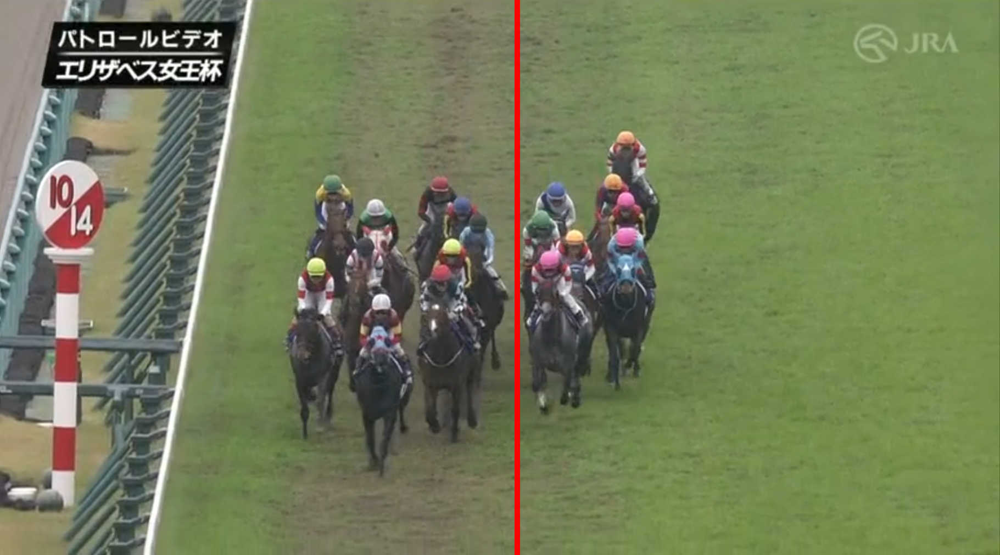

## デアリングタクトに関するお気持ち

いろんな感情があふれてまとまらないので箇条書きで。

- デアリングタクトはすごく頑張って力を出した
- 陣営も臨戦過程を工夫して馬の状態とやる気を上向かせてくれた
- 鞍上も宣言通りにポジションを取りに行く攻めた競馬をしてくれた
- 何も言うことはなく、精一杯走ってくれたことに感謝するし、応援できて本当に良かった
- ただ一方で、この負けは率直に受け止めなければいけないと思う
- 道中馬場の悪い内を通り続けたこと、馬群に揉まれたこと事実だが、デアリングタクトは道悪実績があるし、坂を上るまで伸びていたので力は出せた
- 18人気ながら７着に入ったホウオウエミーズが同じ内から３頭目を道中進んでおり、それでいてデアリングタクトと3/4馬身差だった。ホウオウは道悪巧者だが、それでもこの結果を結果として受け止めなければ先に進めない
- 少なくとも次のレースは、相手関係もふくめて勝てるレース選択が大事ではないか
- 脚元が悪い中、最後まで伸びていたので、馬の闘志が失われていないことは改めて確認できたし、それは好材料
- いったん休養して立て直してほしい
- これからも応援する

## レース回顧

阪神競馬場は予報通り午前から雨が降った。10時17分に小雨、同54分から雨に変わり、13時09分に芝ダートともに重発表。14時09分に雨から曇りへと変わったが内から乾くということもなく外有利のトラックバイアスとなった。

画像は向正面での隊列。解像度が低いので分かりにくいが、赤い線から左に３頭分の馬場が茶色く荒れている。赤線右にいる８頭で１～５着を独占しているのだからトラックバイアスは顕著だったと言えるだろう。

以下に、１～５着＋デアリングタクトが道中赤線の内にいたか外にいたかを記す。表記は、（１～２コーナー－向正面－３～４コーナー－最終直線）の４つ。

- １着：ジェラルディーナ（外－外－外－外）
- ２着：ウインマリリン（外－外－外から内－内から外）
- ２着：ライラック（線上－外－外－外）
- ４着：アカイイト（外－外－外－外）
- ５着：ナミュール（外－外－外－外）
- ６着：デアリングタクト（内－内－内から外－外）

### ウインマリリン

先行で唯一掲示板内に粘ったウインマリリンの進路が面白い。道中は外に陣取りつつも４コーナーでロスを嫌って内に切れ込み、最終直線では右ムチを入れて少しずつ外に持ち出している。おそらく４コーナーはみんなが仕掛ける分どうせ内も外も馬場が傷んでいるから少しでもロスを抑えようという腹だったのだろう。

鞍上のダミアン・レーン騎手はオーストラリアのジョッキーで、外国人騎手らしく豪腕で追うタイプなのだが、同時に進路取りが非常に緻密で、道中内に張り付いておきながら直線では横滑りするように大外へ持ち出したりする（2019年有馬記念、2022年オークスなど）。阪神2200のGⅠもリスグラシューやヒシイグアスで実績があり、今回もその手腕が遺憾なく発揮された。

### ジェラルディーナ

小倉の条件戦では最後まで加速ラップを踏むなどエンジンの掛かりの遅い馬で、オールカマーはロングスパート戦になりやすので本命に推したが、ウインマリリンを再現を狙った横山武史騎手の好騎乗もあってややフロック感があった。

上記に加えてナツコクでの好走から軽い芝でこその馬だろうと評価を下げたのだが、重馬場もなんの、その長くいい脚を使って勝利をもぎとった。

クラスが上がっても上がり最速を使い続けてきたのは伊達ではなく、そして力もつけてきた、ということなのだろう。

ところでこの馬で面白いのは、共同記者会見で斎藤調教師が福永騎手への感謝を口にしていたことだ。「（ジェラルディーナは折り合いの難しい馬だったが）福永さんが乗りやすい馬にしてくれた」。

福永騎手は折り合いで乗るタイプなだけに若駒の育成という面では定評があり、同時に長く主戦を務めてきたジョッキーに大一番で鞍上を任せられなかった想いみたいなものもあったのかと思うとやや興味深いシーンであった。

父系は２着のウインマリリン同様グラスワンダーの血統。モーリスは初年度に有力牝馬をかなりあてがってもらった割にエピファネイア（同じロベルト系）の後塵を拝していたが、ここに来て晩成だったじぶんと同じ成長力を産駒で見せられたのは大きい。自身が勝った距離以上でのGⅠ勝利もまた価値がある。来年の種牡馬勢力図に影響がありそうな１勝。

### ナミュール

体が軽く、いかにも牝馬らしい瞬発力タイプな馬だけに、阪神2200ｍしかも重馬場というタフな条件でここまでやれることに驚いた。鞍上によれば３回ぶつかる不利があったということなので尚のこと負けて強しだろう。

ひと夏越して馬体重が増え、追い切りをしっかりできるようなってきたのが強さにつながってる印象。来年のヴィクトリアマイルでは有力な１頭か。
