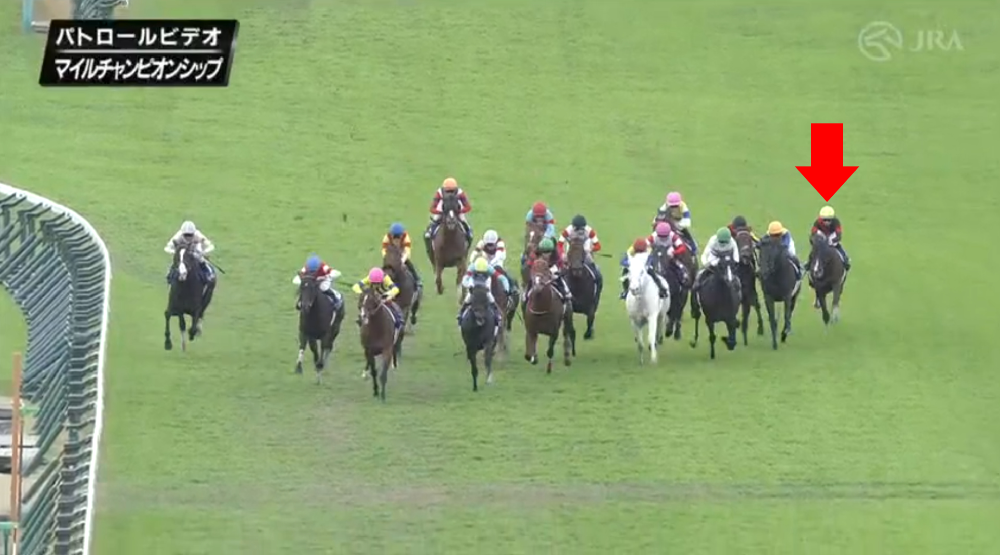
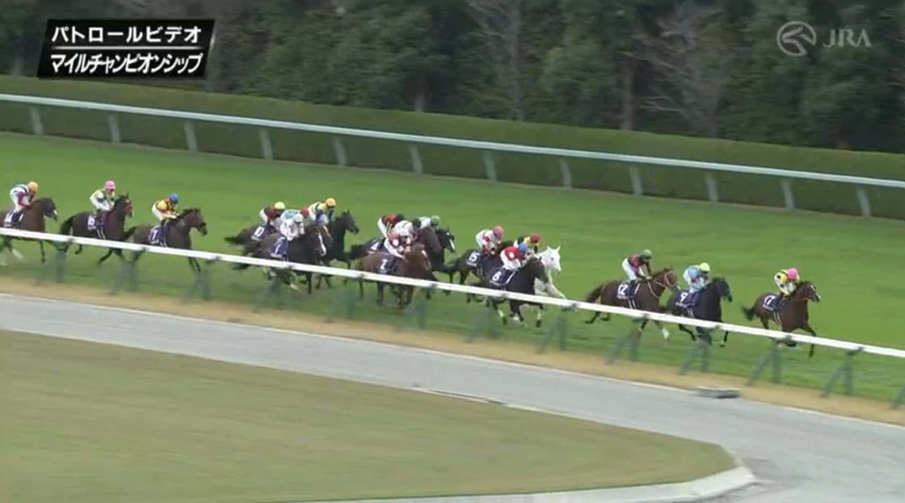

## 予想

◎シュネルマイスター  
○ソウルラッシュ  
▲ダノンスコーピオン

aboutにも書いているようにサリオスは推し馬なのだが、2000mがベストの馬でマイルの流れは合わないと思ってる＆状態不安で消し。詳細は後述。

## レース回顧

### 馬場

先週に引き続きＡコース使用（連続開催15日目）だったが土曜日や午前中の競馬を見ていると内がそこまで悪いという印象はなかった。

午前６時頃から雨が降り、８時には稍重に。８時52分には曇りへ変わり、時折り晴れ間が差し込む空模様。

こういう時は内から乾いて内が有利になるのだが、さすがに先週あれだけ内を荒らしておいてセオリー通りになるのかは分からない、というのが事前予想。

結果としては、最終直線で外に馬が密集しているし、ジョッキーの判断としては外伸びだったのだと思われる。一番外を回したセリフォスが凄まじい末脚で他馬を圧倒したのもその証左になろうか。

ただ、内を突いた（突かざるを得なかった）ジャスティンカフェも前さえ空いていれば馬券内、という脚勢だったので、先週ほど外一辺倒ではなかった印象。

### ペース、隊列

- 12.2 - 11.2 - 11.7 - 11.5 - 11.9 - 11.6 - 10.8 - 11.6
- 58.5 - 34.0（1.32.5）
- RPCI 53.2

1000m通過58.5という字面だけ見るとマイルＧⅠにしてはスローになるが、上がりがそこそこ掛かっているし、PRCIが示す通りミドルペースだった。

その一方で４角で13番手と後方にいたセリフォスが先頭まで1.0秒と馬群は密集しており、レースパターンとしては安田記念同様に団子からの瞬発力勝負。

京都開催のマイルCSだと安田記念とリンクしない（両レースで好走する馬が少ない）が、阪神開催だと連動するという話があって、ペースの観点からもそれがうかがえる。

京都競馬場の改修工事が終わって来年からはまた京都に戻るのだが、東京と阪神のマイルの連動性は頭に入れておきたい。

逃げるのはホウオウアマゾンかと思っていたが、ピースオブエイトが突っ張り、さらには外からファルコニアが前を取るという意外な展開。

その後ろは団子で、馬群が密集している。その馬群の先頭にいるのがソダシ。

普通に考えるならペースを握っているのはソダシで、この馬に合わせて後続は動き出すのだが、吉田隼人騎手は４角で「動かない」を選択。代わりにソウルラッシュの松山騎手が外から仕掛けたのだが、結果的にはこの判断の差が明暗を分けた（後述）。

以下、各馬寸評。

### １着：セリフォス

後方追走から直線で１頭だけ次元の違う豪脚を見せて、競り合う馬たちを外から撫で斬り。2019年有馬記念のリスグラシューを思い出したのだが、やはりレーン騎手のコース選択、直線で馬を追う力は卓抜している。

レース前半は行きたがるところを見せていて、それを上手く宥めて脚を溜めたのも鞍上の手腕。緻密かつ大胆なコース取りは“マジックマン”ジョアン・モレイラを彷彿とさせるし、日本競馬界はもっとレーン騎手を評価しても良いのではないか。

それはさておき、セリフォスの激走に関しては、中内田調教師を真っ先に称えるべきだろう。

直線に入り、他の馬がスパートする中、レーン騎手が悠然と追い出しを待っている姿に「やっぱ神！　レーン神！」と興奮したのだが、冷静になって考えてみると、あれは中内田師の指示もあってのことだと思われる。

中内田充正調教師は、海外の大学を出て海外の名伯楽の元で修行したという異色の経歴の持ち主で、若くして頭角を表したこともあってか割と色々と言われてしまう人だ。その典型が「２歳戦の中内田」「前哨戦の中内田」である。

中内田師はデビュー前からハード調教を課すので仕上がりが早いが、そのぶん３歳や古馬になってからの成長力が乏しい。これまでＧⅠを３勝していたが、すべて２歳戦である。大器ダノンプレミアムも古馬ＧⅠを勝つことはついぞなかった。

それと似た話が、中内田厩舎は前哨戦から仕上げるので本番は走らない、である。これはデータからも本人の談話からも裏付けが取れていて、データ（※集計期間は中内田調教師デビューから先週まで）で言えば、

- ＧⅠ戦：勝率5.6％、連対率16.7％、複勝率24.1%
- 前哨戦：勝率35.2％、連対率55.6％、複勝率63.0％

と歴然たる差がある。

そういった評判があることは本人ももちろん認識していただろう。今までのやり方を捨てれば結果は違ってくるかもしれない。しかし中内田師は、信念に当たる部分（２歳戦、前哨戦でも仕上げる）は変えず、本番でさらに状態を上げるという奥行きを見せてきた。それが最終追い切りの時計の出し方に表れている。

中内田厩舎の最終追い切りはふだん半マイル（800m）を軽めに追うだけなのだが、セリフォスはジョッキー騎乗でCWを長めからびっしり追う（82.4-11.3）というハードな調教を施してきた。

馬は生き物なので、追い切りをやればやるほど良くなるという単純なものではない。ダノンベルーガが追い切りをやりすぎ、コズんだ様子（筋肉痛）をダービーのパドックで見せていたことは記憶に新しい。

富士Ｓでしっかり仕上げつつも、もう一歩踏み込んで新味を見せてきた中内田師の攻めた最終追い切りは称賛されてしかるべきだろう。

そしてもうひとつの好判断。それがセリフォスの脚質転換だ。

セリフォスの父はダイワスカーレットの半兄にあたるダイワメジャーで、早仕掛けからの粘り込みを身上とする馬だった。産駒にもそれを色濃く継承する傾向があって、マイルＧⅠ３勝のアドマイヤマーズなんかはその典型例。

そういう経緯もあってかセリフォスも３歳春まで先行競馬をしていた。しかしラストで甘くなり、ＧⅠではあと１歩で差されるというレースが続き、安田記念から差し～追込に脚質転換する。

安田記念では古馬の強豪に0.1差まで迫り、富士Ｓでは上がり最速で差し切り、そして本番のマイルCSでは他馬を置き去りにする目の覚めるような末脚で初ＧⅠ制覇に至った。

これもまた中内田師が攻めた結果であり、春から準備してきたことが報われた瞬間だ。

最終直線で、他馬がスパートする中、どっしりと構えたレーン騎手は絶賛に値するが、その判断を支えたのは中内田師と彼が育てた馬への信頼だろう。

データは過去を表すことはできるけど、未来を予測するツールではない。未来を形作るのはいつだって人の手だ。なんかそういうことを思わされたセリフォスの勝利だった。

### ２着：ダノンザキッド

ぶっちゃけ軽視してましたゴメンナサイ。

去年同条件でグランアレグリアに0.2差、シュネルマイスターに0.1差、インディチャンプを差し切った。今年もそんなに能力が衰えた風もない。なのに何故軽視してしまったのか。その謎を探るべく我々は栗東に飛ｎ（ｒｙ

内枠からのスタートで少しやりにくそうに見えたが道中はソダシの後ろに入れてうまく折り合いをつけ、最終直線では他馬と接触するシーンがありながらもそれでも怯まずソダシを振り切って２着確保。

大怪我からの長期休養明けでなかなか大舞台で活躍できていなかった北村友一騎手の好騎乗に、ダノンザキッドがよく応えたと思う。あそこまで行ったら勝ちたかっただろうなあ。

### ３着：ソダシ

ぶっちゃけ軽視（ｒｙ

ソダシはクロフネ産駒らしく、ワンペースで力を発揮する馬で、スローからの瞬発戦が予想された今年のマイルCSはペースが合わないと思っていた。

実際そういうところはあって、最後は他馬に脚勢で見劣ったが、それでも３着に残す辺りは、かつてサトノレイナスの猛追を２度とも退けた桜の女王の意地、と言うべきだろう。

それともひとつ、先述した通り、４コーナーでひと溜めしたのは最後の粘りにつながったと思う。これはソウルラッシュと比較すると分かりやすい、吉田隼人騎手の好判断。

### ４着：ソウルラッシュ

「本当は馬の後ろで我慢させたかったのですが、なかなか入れませんでした」という松山騎手のレース後コメントを見る限り、ダノンスコーピオンの後ろ辺りで脚を溜めたかったんだろうなと思う。しかしシュネイルマイスターが内から張り出してきたぶん外に追い出され、それはかなわなかった。

それもあってか、４コーナーでは他馬に先駆けてワンテンポ先に動いた。内から５頭ぶんの大外をまくる形になり、それが最終直線の脚色の悪さにつながった。

まあレースを見ていると、そうしたというよりせざるを得なかった、という感じなのだが、それにしても松山騎手、先週に引き続き「持ってない」。

１頭１頭のタイムトライアルではなく、多頭数でのレースだからこういうこともあるのだが、それにしても、と思ってしまう。

### ５着：シュネイルマイスター、６着：エアロロノア

最終直線でいっしょうけんめい外に出そうとするシュネルマイスターと、外に出させないよう全力でブロックするエアロロノア。

クリストフ・クリスマスオグリ・ルメール「固有もノンストも出てマース！　ユタカサンそこどいてくだサーイ！」  
武・スペシャルウィーク・豊「どきません！」

チャンピオンズミーティングかな？

### 14着：サリオス

朝日杯FSを勝ってはいるが、２歳戦にしてはかなりのハイペースで、それを前から粘り込み。サリオスのタフさが活きるレースだった。

ここ２年のマイルCSでは前から行っても後ろから行っても結果が出ていない。スローからの上がり勝負になるとマイルの一流どころと戦うには決め手で劣る印象、というのが個人的なサリオス評で、だから２年前から秋天に行ってほしいと言い続けてるのだが、これでマイルCS３年連続の参戦。

使い分けなのか適性判断なのかは知らないが、コントレイルに比肩するだけのポテンシャルを秘めていたサリオスの本領はついぞ発揮されないまま引退に至りそうだ。それが悲しく、やるせない。

ただ今回に関しては毎日王冠である程度仕上げていたにも関わらず最終追い切りで時計を出して失速ラップという明らかなデキ落ちが見て取れたので、秋天に行っても好走できなかったと思う。

毎日王冠での勝利は大声を上げるほど嬉しかったが、その代償がこの状態なのだとしたら、それもまた辛い話である。
